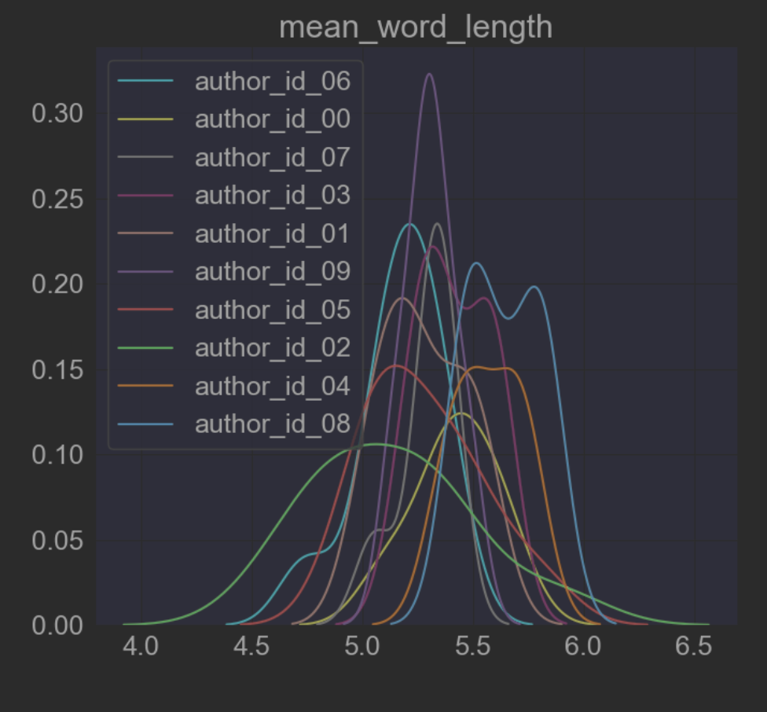
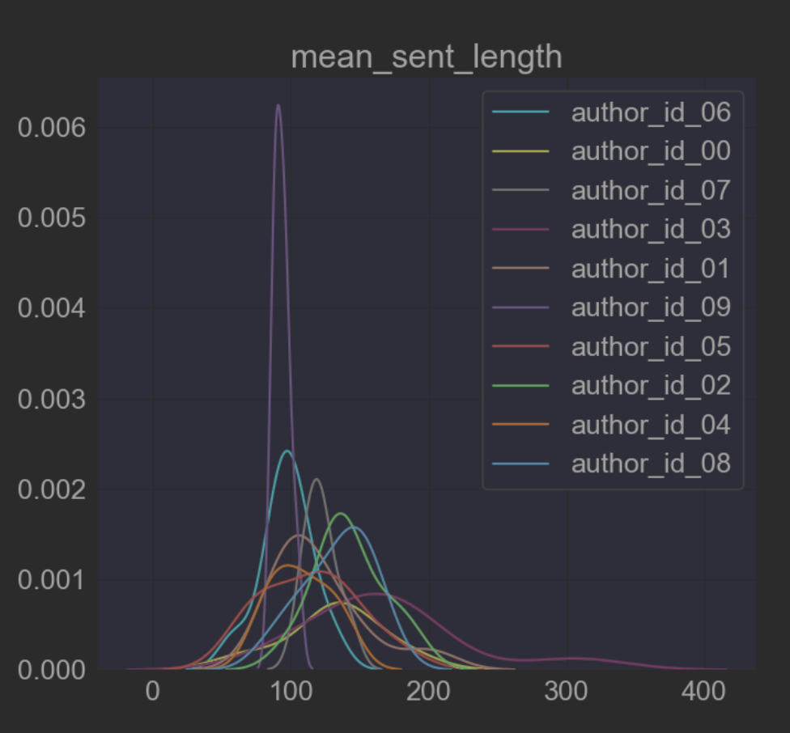
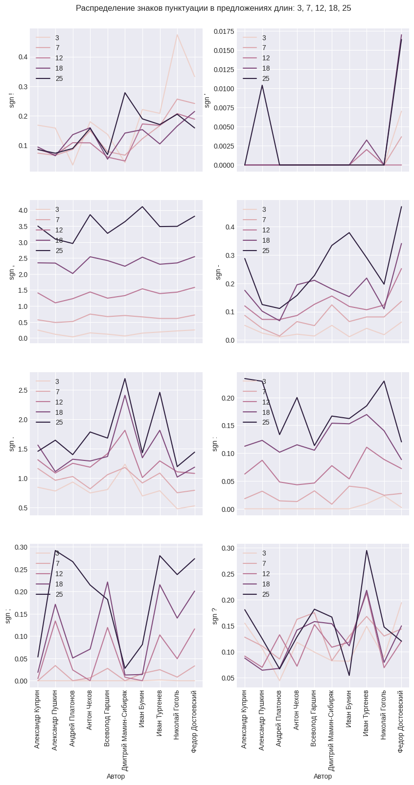
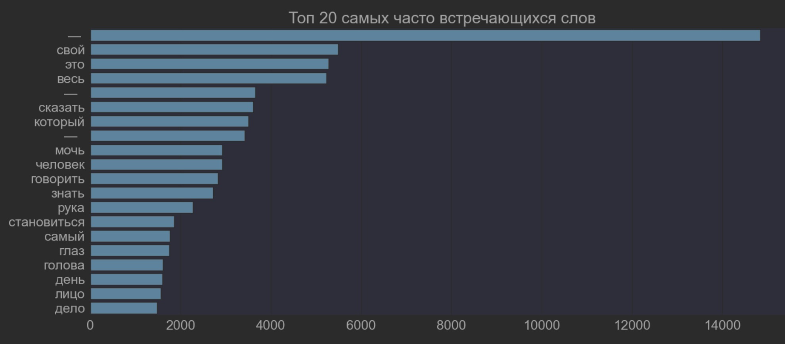
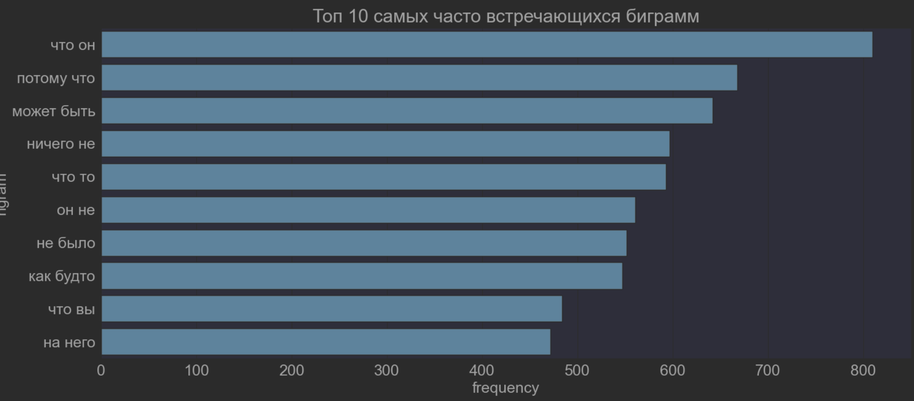
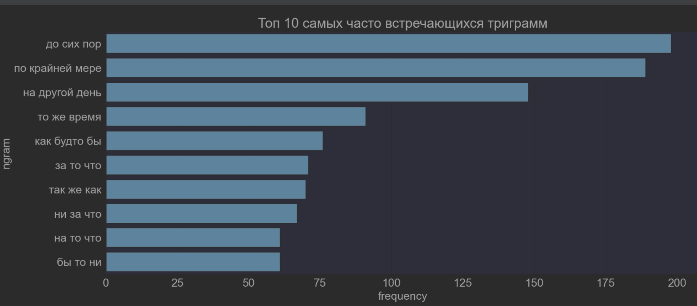
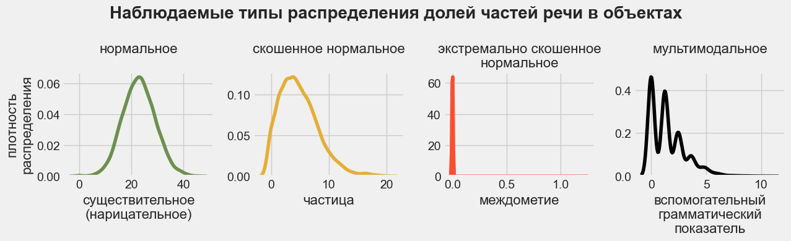
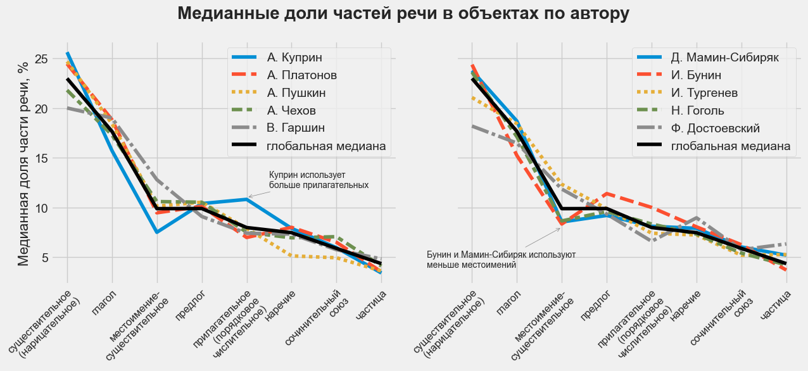
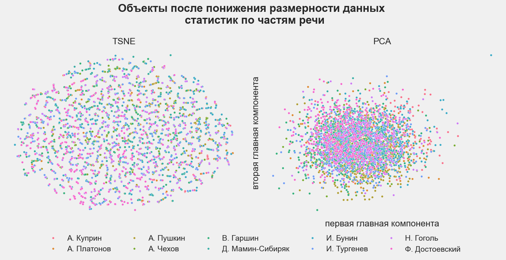

# Определение авторства текстов

_Проект студентов первого года магистратуры НИУ ВШЭ «Машинное обучение и
высоконагруженные системы» (23/24)_

## Задача

Создать ML сервис для определения авторства текстов на основании фрагмента из
5-10 предложений.

## Состав команды

- [Дарья Мишина](https://github.com/DariaMishina)
- [Кирилл Рубашевский](https://github.com/kirill-rubashevskiy)
- [Дмитрий Шильцов](https://github.com/DmitriyShiltsov)
- [Елена Вольф](https://github.com/Graf-D) (куратор)

## Структура репозитария

```bash
├── .dvc # DVC config
├── app # FastAPI app with ML model
├── assets # images and presentations
├── bot # Telegram bot (production)
├── commands.py # .py script for running ML experiments
├── compose.yaml # Docker Compose for building images
├── conf # Hydra project configs
├── data # DVC-tracked data
├── GRAM_bot # Alternative Telegram bot
├── LLM_bot # Telegram bot with DL model (development, run locally)
├── mlds23_authorship_identification
│   ├── classifiers.py # models zoo for ML experiments
│   ├── extractors.py # feature extractors
│   ├── parser.py # parser
│   ├── preprocessing.py # preprocessing classes and functions
│   └── utils.py
├── models # DVC-tracked trained models
├── notebooks
├── poetry.lock # dependency management
├── production.yaml # Docker Compose for running containers
├── pyproject.toml # project and dependency management
└── tests
```

## Структура сервиса


Сервис состоит из:

- [FastAPI приложения](https://mlds23-authorship-identification-app.onrender.com)
- [Telegram бота для общения с пользователями](https://t.me/mlds23_ai_bot)
- обученной ML модели
- баз данных PostgresSQL (для хранения статистик использования сервиса) и Redis
  (для кэширования запросов в PostgresSQL)

Приложение, бот и базы данных развернуты на render.com; ML модель размещена в S3
хранилище Yandex Cloud Storage.

Приложение и бот контейнизированы, мультиплатформенные образы доступны в Docker
Hub:

```bash
docker pull kirillrubashevskiy/mlds23-authorship-identification:app-latest # образ приложения
docker pull kirillrubashevskiy/mlds23-authorship-identification:bot-latest # образ бота
```

Приложение и бот могут работать с базами данных:

- из контейнеров
- развернутыми локально
- предоставляемыми хостингом приложения и бота

## Работа с сервисом

Сервис может определять автора одного текста и авторов нескольких текстов,
собранных в .csv-файл.

- подсказку по работе с FastAPI приложением можно получить в его
  [документации](https://mlds23-authorship-identification-app.onrender.com/docs)
- подсказку по работе Telegram бота можно получить в его стартовом меню

<details>

<summary>примеры работы Telegram бота</summary>


</details>

<details>

<summary>примеры работы FastAPI приложения</summary>


</details>

## Локальный запуск сервиса

<details>

<summary>для запуска FastAPI приложения</summary>

1. Установите [Docker](https://docs.docker.com/get-docker/)

2. Клонируйте репозитарий:

```bash
git clone https://github.com/kirill-rubashevskiy/mlds23-authorship-identification.git
```

3. Создайте виртуальное окружение
4. В корневой папке репозитария выполните команду:

```bash
# команда создает и запускает Docker-контейнеры сервиса
docker compose -f production.yaml --profile app up
```

FastAPI приложение будет доступно по адресу: http://0.0.0.0:8000

</details>

<details>

<summary>для запуска FastAPI приложения вместе с Telegram ботом </summary>

1. Установите [Docker](https://docs.docker.com/get-docker/)

2. [Зарегистрируйтесь](https://ngrok.com/signup) в ngrok и получите в личном
   кабинете:

- `Authtoken` (вкладка Your Authtoken) и
- `static domain` (вкладка Your Domains, выглядит как
  domain-name.ngrok-free.app)

3. Создайте бота в Telegram при помощи
   [BotFather](https://telegram.me/BotFather) (при создании будет сгенерирован
   токен)

4. Клонируйте репозитарий:

```bash
git clone https://github.com/kirill-rubashevskiy/mlds23-authorship-identification.git
```

5. Создайте виртуальное окружение
6. В корневой папке репозитария создайте файл `.env` со следующими переменными
   окружения:

```dosini
# пример .env
BASE_WEBHOOK_URL=base_webhook_url # заменить значение на static domain из шага 1
NGROK_TOKEN=ngrok_token # заменить значение на Authtoken из шага 1
BOT_TOKEN=bot_token # заменить значение  на токен из шага 2
```

7. В корневой папке репозитария выполнить команду:

```bash
# команда создает и запускает Docker-контейнеры сервиса
docker compose -f production.yaml --profile full up
```

FastAPI приложение будет доступно по адресу: http://0.0.0.0:8000 \
Бот будет доступен в Telegram по имени, выбранному для бота на шаге 2

</details>

## Воспроизведение экспериментов

<details>

<summary>для воспроизведения экспериментов</summary>

1. Установите [Poetry](https://python-poetry.org/docs/#installation)
2. Клонируйте репозитарий:

```bash
git clone https://github.com/kirill-rubashevskiy/mlds23-authorship-identification.git
```

3. Создайте виртуальное окружение
4. Установите зависимости проекта:

```bash
poetry install
```

5. Проводите эксперименты при помощи `commands.py` (для логирования
   экспериментов в Weights & Biases укажите свои W&B credentials в
   `conf/config.yaml`):

```bash
python3 commands.py train 'TF-IDF stats poly LR'  logisticregression__С=2 # обучение модели
python3 commands.py infer models/bow_stats_poly_lr.joblib.dvc # тестирование модели
python3 commands.py randomsearch 'TF-IDF stats poly LR' # подбор гиперпараметров при помощи Random Search
```

</details>

## Тесты

```bash
coverage report
Name                                                Stmts   Miss  Cover
-----------------------------------------------------------------------
app/crud.py                                            35      1    97%
app/database.py                                         3      0   100%
app/dependencies.py                                    29      4    86%
app/main.py                                            39      8    79%
app/models.py                                           7      0   100%
app/routers/items.py                                   25      0   100%
app/routers/users.py                                   35      0   100%
app/schemas.py                                         19      0   100%
bot/keyboards.py                                       16      0   100%
bot/routers/items.py                                   47      0   100%
bot/routers/users.py                                   46      0   100%
bot/states.py                                           7      0   100%
bot/utils.py                                           16      0   100%
mlds23_authorship_identification/extractors.py         89      4    96%
mlds23_authorship_identification/preprocessing.py     193     76    61%
mlds23_authorship_identification/utils.py              37     22    41%
-----------------------------------------------------------------------
TOTAL                                                 643    115    82%
```

<details>

<summary>для тестирования</summary>

1. Установите [Poetry](https://python-poetry.org/docs/#installation),
   [Redis](https://redis.io/docs/install/install-redis/) и
   [PostgreSQL](https://www.postgresql.org/download/)
2. Создайте тестовую базу данных:

```postgresql
CREATE DATABASE ai_test_db;
CREATE USER ai_user WITH PASSWORD 'ai_password';
GRANT ALL PRIVILEGES ON DATABASE ai_test_db TO ai_user;
```

3. Клонируйте репозитарий:

```bash
git clone https://github.com/kirill-rubashevskiy/mlds23-authorship-identification.git
```

4. Создайте виртуальное окружение
5. Установите зависимости проекта:

```bash
poetry install
```

6. Запустите тесты:

```bash
pytest
```

</details>

## Работа над проектом

### Предварительный план работы

1. Сбор данных (до 31 октября 2023 года)
2. Разведочный анализ данных (до 15 ноября 2023 года)
3. ML-эксперименты и создание MVP (до 4 марта 2024 года)
4. DL-эксперименты (срок TBA)
5. Доработка MVP в полноценный сервис и deployment (срок TBA)

### Сбор данных

На данном этапе мы:

- отобрали авторов для обучения моделей
- собрали тексты авторов из открытых источников при помощи разработанного
  парсера
- разместили собранные данные в S3 хранилище

<details>
  <summary><b>Подробнее</b></summary>

Для проекта были отобраны 10 классических русских писателей, живших в 19 веке:

- И. А. Бунин
- В. М. Гаршин
- Н. В. Гоголь
- А. И. Куприн
- Ф. М. Достоевский
- Д. Н. Мамин-Сибиряк
- А. П. Платонов
- А. С. Пушкин
- И. С. Тургенев
- А. П. Чехов

По каждому автору было собрано не менее 10 прозаических произведений.

Данные были собраны на
[сайте интернет-библиотеки Алексея Комарова](https://ilibrary.ru/)
([ноутбук](notebooks/01_parsing.ipynb) с примером работы парсера).

Собранные данные (тексты в формате .txt, а также .csv файл с общей информацией о
текстах) размещены в облачном хранилище Yandex Object Storage. На
[сайте хранилища](https://mlds23-authorship-identification.website.yandexcloud.net)
доступна таблица с полной информацией о собранных текстах.

</details>

### Разведочный анализ данных

На данном этапе мы:

- проанализировали статистики из текстов
- критически оценили нграммы (уни-, би- и триграммы)
- проанализировали части речи (в целом и для предложений разной длинны)
- провели тематическое моделирование

<details>
  <summary><b>Подробнее</b></summary>

#### Статистики из текстов

([ноутбук](notebooks/05_eda_dm_stats_ngrams.ipynb) с анализом статистик из
текстов и нграмм, [ноутбук](notebooks/05_eda_shiltsov_punct_grams.ipynb) с
анализом статистик по пунктуации и частям речи в зависимости от длины
предложений)

Для начала мы посчитали среднюю длину слова и предложения по каждому автору:




На графиках видно, длина слов и предложений у авторов различаются, поэтому было
принято решение сделать углубленный анализ следующих статистик с помощью пакета
`ruts`:

- количество предложений
- количество слов
- количество уникальных слов
- количество длинных слов
- количество сложных слов
- количество простых слов
- количество односложных слов
- количество многосложных слов
- количество символов
- количество букв
- количество пробелов
- количество слогов
- количество знаков препинания

В результате датасет `splitted_df` с уже расспличенными по 550 токенов
произведениями был дополнен колонками, перечисленными выше, и сохранен в s3 как
`ruts_df`.

Также был сделан анализ использования знаков пунктуации у разных авторов в
предложениях различной длины:

**Вывод: авторы по-разному строят предложения разной длины с точки зрения знаков
препинания, возможно это может дать полезные дополнительные признаки для
обучения моделей.**



На следующем этапе мы попробуем использовать эти статистики в качестве признаков
для классификации.

#### Нграммы

([ноутбук](./EDA/EDA_DM.ipynb) с анализом статистик из текстов и нграмм)

Для расширения стоплиста слов мы проанализировали самые часто встречающиеся
слова:



На графике видны погрешности в предобработке (аномально длинное тире с
пробелами); 50 самых часто встречающихся слов сохранены в s3 для последующего
анализа как `count_words`.

Мы также проанализировали топ10 биграмм и триграмм:




#### Анализ частей речи

([ноутбук](notebooks/05_eda_kr_pos_topic_modeling.ipynb) с анализом частей речи
и тематическим моделированием,
[ноутбук](notebooks/05_eda_shiltsov_punct_grams.ipynb) с анализом статистик по
пунктуации и частям речи в зависимости от длины предложений)

Для анализа частей речи мы:

- просемплировали объекты таким образом, чтобы по каждому автору было одинаковое
  количество объектов
- провели предобработку данных:
  - привели тексты к нижнему регистру
  - удалили http ссылки, цифры и пунктуацию
  - токенизировали тексты
  - определили часть речи каждого токена при помощи библиотеки `spaCy`
- по каждому объекту посчитали количество вхождений каждой части речи и
  нормализовали данные (чтобы сумма вхождений всех частей речи в объект давала
  единицу)

Затем мы проанализировали распределения частей речи по всем объектам, и
статистики распределений по автору.

Распределения значений частей речи соответствуют одному из четырех типов:



Мы проверили, что мультимодальное распределение отдельных частей речи
наблюдается у всех авторов (гипотеза подтвердилась), и для дальнейшего анализа
оставили только части речи с нормальным и скошенным нормальным распределениями.

Мы анализировали медиану, которая меньше подвержена выбросам:



Авторы различаются по медианной частоте использования частей речи:

- Куприн использует больше нарицательных и прилагательных, но меньше глаголов и
  местоимений
- Пушкин использует меньше наречий и сочинительных союзов
- Бунин использует больше нарицательных, прилагательных и предлогов, но меньше
  местоимений и глаголов и т.д.

При этом понижение размерности данных при помощи PCA (мы дополнительно
ограничили значения сверху 99-м персентилем и стандартизировали данные) и TSNE
не позволило кластеризовать авторов:



**Вывод: статистики по частям речи могут быть дополнительными признаками для
обучения моделей, но эффект от них (без нелинейного преобразования) будет
ограничен при использовании линейных моделей.**

Мы разместили сгенерированные признаки (нормированное количество каждой части
речи в объекте) в облачном хранилище Yandex Object Storage по проекту для их
использования при обучении моделей.

Мы также проанализировали распределение частей речи в зависимости от длины
предлоожений:


**Вывод: авторы по-разному строят предложения разной длины с точки зрения
употребления частей речи, возможно это может дать полезные дополнительные
признаки для обучения моделей.**

#### Тематическое моделирование

([ноутбук](notebooks/05_eda_kr_pos_topic_modeling.ipynb) с анализом частей речи
и тематическим моделированием)

Для тематического моделирования мы использовали все объекты датасета и три части
речи: существительные (нарицательные), прилагательные и глаголы.

Перед тематическим моделированием мы провели предобработку текстов:

- привели тексты к нижнему регистру,
- удалили http ссылки, цифры, пунктуацию
- удалили стоп-слова: неправильно классифицированные имена собственные
  (`аркадий`, `наташа`и т.п.) и слова, которые не несут смысловой нагрузки
  (`хотеть`, `быть` и т.п.)
- удалили слишком редкие (встречающиеся менее 3 раз) и слишком частые
  (встречающихся более, чем в половине объектов) слова
- токенизировали или лемматизировали тексты

Для тематического моделирования мы использовали алгоритм LDA. Мы создали
несколько моделей в зависимости от количества предсказываемых ими тем (от 10 до
30 с шагом 5), и для оценки качества работы моделей использовали оценку асессора
(меня) на 10 случайных объектах.

Каждая модель смогла (субъективно) корректно определить темы от 0 до 3 объектов:

- модель с 10 темами — природу (объект 1), выражение эмоций (объект 2) и лошадей
  (объект 5)
- модель с 20 темами — происходящее на улице (объект 5) и внешние характеристики
  героя (объект 10)
- модель с 25 темами — происходящее на улице (объект 5)
- модель с 30 темами — природу (объект 1), помещения (объект 3) и внешние
  характеристики героя (объект 10)

Определить темы отдельных объектов (например, 4 и 7) не смогли как модели, так и
асессор; возможные причины:

- деление на объекты не учитывает абзацы, которые отдельные авторы используют
  для разграничения тем
- с учетом ограничения на максимальное количество слов в объекте, отбора частей
  речи и удаления стоп-слов после предобработки в объектах не остается
  достаточное количество несущих смысл слов для корректного определения темы

**Вывод: использование предсказанных моделями тем и их вероятностей
нецелесообразно использовать в качестве признаков для обучения моделей,
классифицирующих авторов.**

</details>

### ML-эксперименты и создание MVP

На данном этапе мы:

- провели эксперименты с различными предобработкой данных (удаление стоп-слов,
  удаление пунктуации, лемматизация), способами создания признаков
  (Bag-of-Words, TF-IDF, текстовые статистики) и семействами моделей (линейные
  модели, вероятностные модели, KNN, решающие деревья и их ансамбли)
- разработали MVP в формате ТГ-бота

MVP развернут на render.com и доступен по ссылке https://t.me/mlds23_ai_bot

### DL-эксперименты

На данном этапе планируется:

- использовать трансформеры (с дообучением на собранном датасете)
- дообучить LLM-модель (Llama, Mistral, Saiga)
- обучить классические ML-модели на эмбеддингах из DL-модели

### Доработка MVP в полноценный сервис и deployment

На данном этапе планируется доработать MVP в полноценный веб сервис
