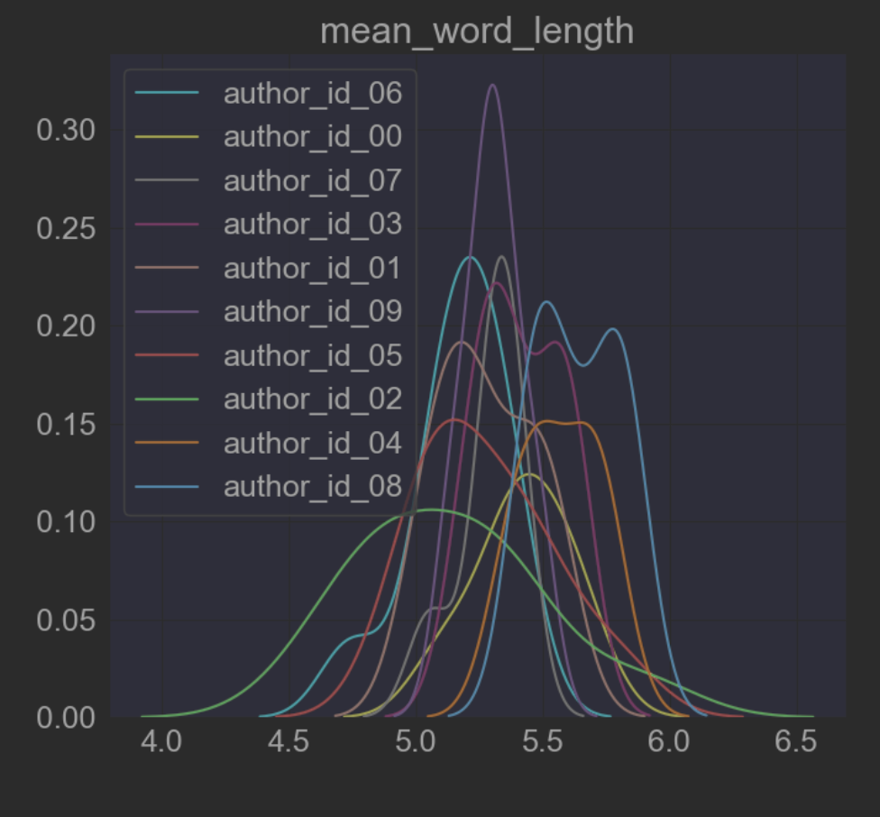
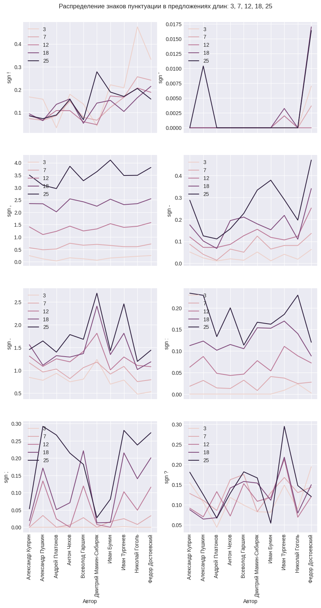
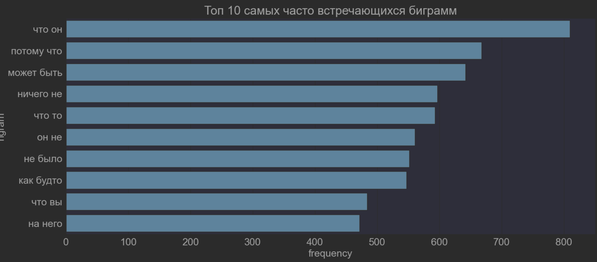
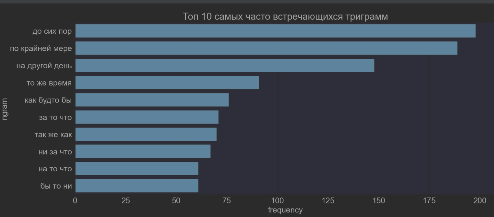
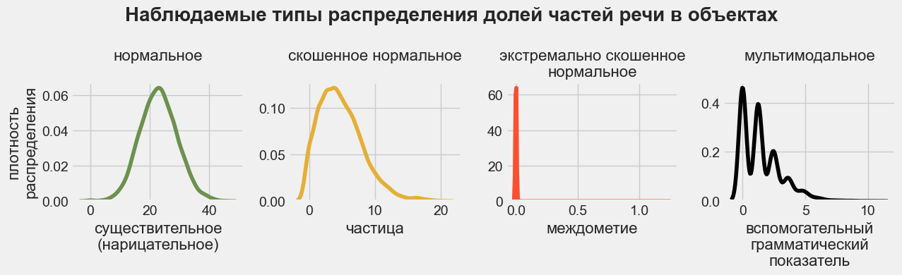
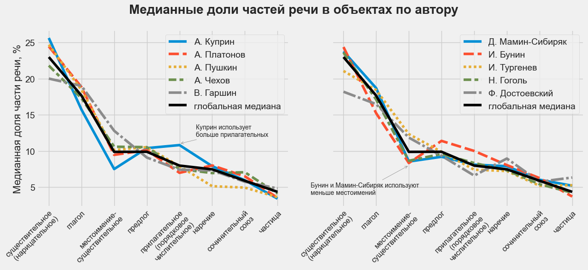
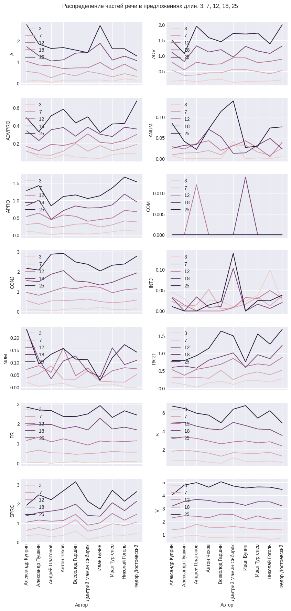

# Определение авторства текстов

## Описание проекта

Создание ML-сервиса для определения авторства текста: на основании фрагмента из 5-10 предложений сервис будет предсказывать, написан ли фрагмент одним из авторов, чьи тексты использовались для обучения модели, или иным лицом.

## Состав команды

- [Дарья Мишина](https://github.com/DariaMishina)
- [Кирилл Рубашевский](https://github.com/kirill-rubashevskiy)
- [Дмитрий Шильцов](https://github.com/DmitriyShiltsov)

Куратор: [Елена Вольф](https://github.com/Graf-D)

## Предварительный план работы

1. Сбор данных (до 31 октября 2023 года)
2. Разведочный анализ данных (до 15 ноября 2023 года)
3. Обучение классических ML-моделей и создание MVP (до 17 декабря 2023 года)
4. Обучение DL-моделей (срок TBA)
5. Доработка MVP в полноценный сервис и deployment (срок TBA)

## Сбор данных 

На данном этапе команда:
 
- отобрала авторов для обучения моделей
- собрала тексты авторов из открытых источников при помощи разработанного парсера
- разместила собранные данные в S3 хранилище

Для проекта были отобраны 10 классических русских писателей, живших в 19 веке:

- И. А. Бунин
- В. М. Гаршин
- Н. В. Гоголь
- А. И. Куприн
- Ф. М. Достоевский
- Д. Н. Мамин-Сибиряк
- А. П. Платонов
- А. С. Пушкин
- И. С. Тургенев
- А. П. Чехов

По каждому автору было собрано не менее 10 прозаических произведений.

Данные были собраны на [сайте интернет-библиотеки Алексея Комарова](https://ilibrary.ru/) (код разработанного парсера и jupyter ноутбук с примером его работы доступны по [ссылке](data_collection)). 

Собранные данные (тексты в формате .txt, а также .csv файл с общей информацией о текстах) размещены в облачном хранилище Yandex Object Storage. На [сайте хранилища](https://mlds23-authorship-identification.website.yandexcloud.net) доступна таблица с полной информацией о собранных текстах.

## Разведочный анализ данных

В рамках данного этапа мы:

- проанализировали статистики из текстов
- критически оценили нграммы (уни-, би- и триграммы)
- проанализировали части речи (в целом и для предложений разной длинны)
- провели тематическое моделирование

### Статистики из текстов

([ноутбук](./EDA/EDA_DM.ipynb) с анализом статистик из текстов и нграмм, [ноутбук](./EDA/base-EDA-stats_(Dmitry).ipynb) с анализом статистик по пунктуации и частям речи в зависимости от длины предложений)

Для начала мы посчитали среднюю длину слова и предложения по каждому автору:

На графиках видно, длина слов и предложений у авторов различаются, поэтому было принято решение сделать углубленный анализ следующих статистик с помощью пакета `ruts`:

- количество предложений
- количество слов
- количество уникальных слов
- количество длинных слов
- количество сложных слов
- количество простых слов
- количество односложных слов
- количество многосложных слов
- количество символов
- количество букв
- количество пробелов
- количество слогов
- количество знаков препинания

В результате датасет `splitted_df` с уже расспличенными по 550 токенов произведениями был дополнен колонками, перечисленными выше, и сохранен в s3 как `ruts_df`.

Также был сделан анализ использования знаков пунктуации у разных авторов в предложениях различной длины:

**Вывод: авторы по-разному строят предложения разной длины с точки зрения знаков препинания, возможно это может дать полезные дополнительные признаки для обучения моделей.**

На следующем этапе мы попробуем использовать эти статистики в качестве признаков для классификации.

### Нграммы

([ноутбук](./EDA/EDA_DM.ipynb) с анализом статистик из текстов и нграмм)

Для расширения стоплиста слов мы проанализировали самые часто встречающиеся слова:

На графике видны погрешности в предобработке (аномально длинное тире с пробелами); 50 самых часто встречающихся слов сохранены в s3 для последующего анализа как `count_words`.

Мы также проанализировали топ10 биграмм и триграмм:

### Анализ частей речи

([ноутбук](./EDA/eda_pos_topic_modeling.ipynb) с анализом частей речи и тематическим моделированием, [ноутбук](./EDA/base-EDA-stats_(Dmitry).ipynb) с анализом статистик по пунктуации и частям речи в зависимости от длины предложений)

Для анализа частей речи мы:

- просемплировали объекты таким образом, чтобы по каждому автору было одинаковое количество объектов
- провели предобработку данных:
    - привели тексты к нижнему регистру
    - удалили http ссылки, цифры и пунктуацию
    - токенизировали тексты
    - определили часть речи каждого токена при помощи библиотеки `spaCy`
- по каждому объекту посчитали количество вхождений каждой части речи и нормализовали данные (чтобы сумма вхождений всех частей речи в объект давала единицу)

Затем мы проанализировали распределения частей речи по всем объектам, и статистики распределений по автору.

Распределения значений частей речи соответствуют одному из четырех типов:

Мы проверили, что мультимодальное распределение отдельных частей речи наблюдается у всех авторов (гипотеза подтвердилась), и для дальнейшего анализа оставили только части речи с нормальным и скошенным нормальным распределениями. 

Мы анализировали медиану, которая меньше подвержена выбросам:

Авторы различаются по медианной частоте использования частей речи:

- Куприн использует больше нарицательных и прилагательных, но меньше глаголов и местоимений
- Пушкин использует меньше наречий и сочинительных союзов
- Бунин использует больше нарицательных, прилагательных и предлогов, но меньше местоимений и глаголов и т.д.

При этом понижение размерности данных при помощи PCA (мы дополнительно ограничили значения сверху 99-м персентилем и стандартизировали данные) и TSNE не позволило кластеризовать авторов:

**Вывод: статистики по частям речи могут быть дополнительными признаками для обучения моделей, но эффект от них (без нелинейного преобразования) будет ограничен при использовании линейных моделей.** 

Мы разместили сгенерированные признаки (нормированное количество каждой части речи в объекте) в облачном хранилище Yandex Object Storage по проекту для их  использования при обучении моделей.

Мы также проанализировали распределение частей речи в зависимости от длины предлоожений:

**Вывод: авторы по-разному строят предложения разной длины с точки зрения употребления частей речи, возможно это может дать полезные дополнительные признаки для обучения моделей.**

### Тематическое моделирование

([ноутбук](./EDA/eda_pos_topic_modeling.ipynb) с анализом частей речи и тематическим моделированием)

Для тематического моделирования мы использовали все объекты датасета и три части речи: существительные (нарицательные), прилагательные и глаголы.

Перед тематическим моделированием мы провели предобработку текстов:

- привели тексты к нижнему регистру,
- удалили http ссылки, цифры, пунктуацию
- удалили стоп-слова: неправильно классифицированные имена собственные (`аркадий`,  `наташа`и т.п.) и слова, которые не несут смысловой нагрузки (`хотеть`, `быть` и т.п.)
- удалили слишком редкие (встречающиеся менее 3 раз) и слишком частые (встречающихся более, чем в половине объектов) слова
- токенизировали или лемматизировали тексты

Для тематического моделирования мы использовали алгоритм LDA. Мы создали несколько моделей в зависимости от количества предсказываемых ими тем (от 10 до 30 с шагом 5), и для оценки качества работы моделей использовали оценку асессора (меня) на 10 случайных объектах.

Каждая модель смогла (субъективно) корректно определить темы от 0 до 3 объектов:

- модель с 10 темами — природу (объект 1), выражение эмоций (объект 2) и лошадей (объект 5)
- модель с 20 темами — происходящее на улице (объект 5) и внешние характеристики героя (объект 10)
- модель с 25 темами — происходящее на улице (объект 5)
- модель с 30 темами — природу (объект 1), помещения (объект 3) и внешние характеристики героя (объект 10)

Определить темы отдельных объектов (например, 4 и 7) не смогли как модели, так и асессор; возможные причины:    

- деление на объекты не учитывает абзацы, которые отдельные авторы используют для разграничения тем
- с учетом ограничения на максимальное количество слов в объекте, отбора частей речи и удаления стоп-слов после предобработки в объектах не остается достаточное количество несущих смысл слов для корректного определения темы

**Вывод: использование предсказанных моделями тем и их вероятностей нецелесообразно использовать в качестве признаков для обучения моделей, классифицирующих авторов.**

## Обучение классических ML-моделей и создание MVP

На данном этапе планируется:

- обучить baseline-модель (TF-IDF + логистическая регрессия)
- поэкспериментировать с разными способами создания признаков (Word2Vec, GloVe, текстовые статистики) и семействами моделей (линейные модели, решающие деревья и их ансамбли)
- разработать MVP в формате ТГ-бота, который в ответ на фрагмент текста возвращает предсказание его автора

## Обучение DL-моделей

На данном этапе планируется:

- использовать трансформеры (с дообучением на собранном датасете)
- дообучить LLM-модель (Llama, Mistral, Saiga)
- обучить классические ML-модели на эмбеддингах из DL-модели

## Доработка MVP в полноценный сервис и deployment

На данном этапе планируется доработать MVP в полноценный веб сервис